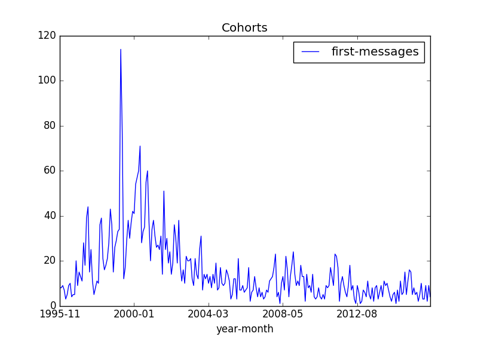
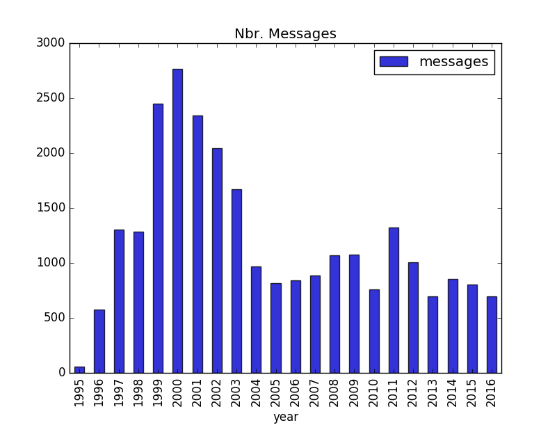
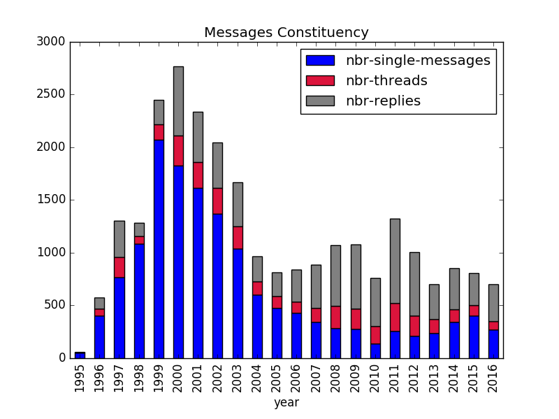
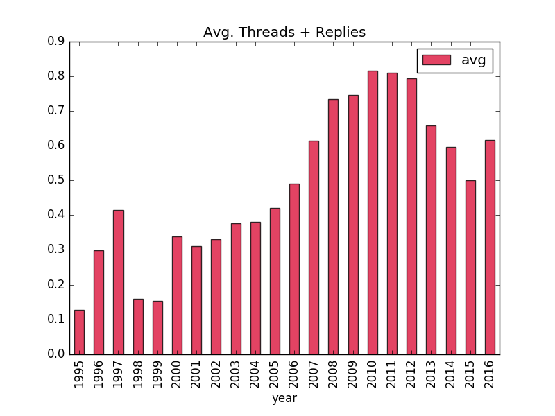
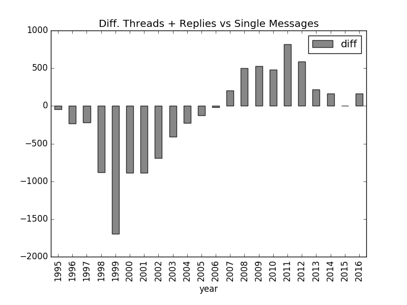
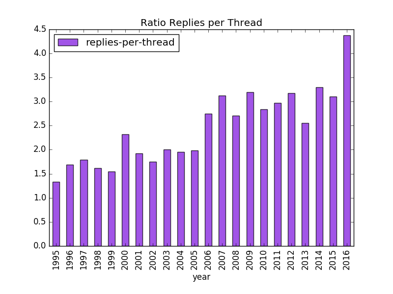
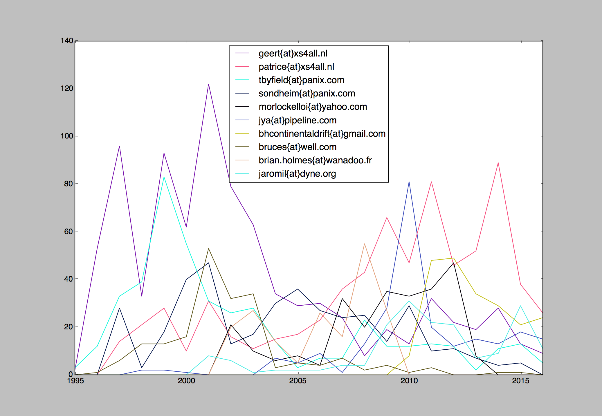
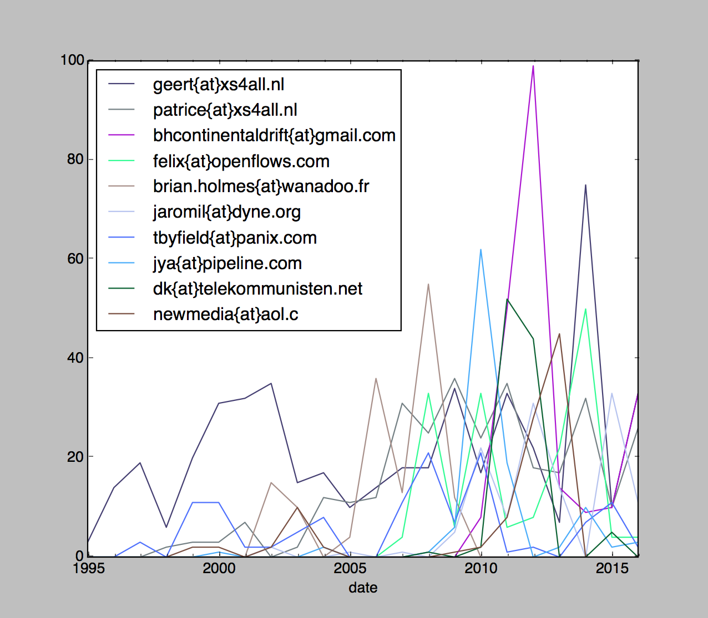

#Synopsis

While contemporary social media have been critiqued for their ephemeral effects on activist politics, the mailing list has proven an enduring venue for geographically dispersed communities to participate and remain in dialog over the course of decades. Founded in Amsterdam in 1995, the Nettime mailing list ([http://nettime.org](http://nettime.org)) has played host to a community of activists and media artists and help to launch or establish the careers of a number of prominent new media theorists and Internet critics. Established in an era prior to the corporatization of the Web, over the course of its twenty first years (1995-2016), Nettime has continued to discuss the Web in terms of the radical political possibilities with which it was imagined in its ‘salad days’.

This project aims to trace the evolution of Nettime (more precisely nettime-l) through a survey of its mailing list's archive ([http://nettime.org/archives.php](http://nettime.org/archives.php)). 

#Survey

During our quick investigation of Nettime's list structure and content, we came up with three main clusters of questions that we subsequently approached in our study.

* List activity: As a mailing list, Nettime is popularly associated with mid-90s / early 2000s media activism, yet it continues to be active to this day. 

	* When was Nettime most active?
	* Does Nettime have periods and/or cohorts?

* List vigour: A mailing list's health may, perhaps, be seen as a function of the extent to which it is a space of dialogue.

	* When was Nettime at its most dialogical?
	* What can be a sound measure of Nettime's vigour (over time)?	

* Outspokeness: Mailing lists, such as Nettime, tend to be influenced by stark intellectual and political convictions bolstered by strong personalities.

	* Who have been (are) Nettime's most prolific contributors?
	* Is there different kinds of contributions (posting, threads/replies)?
	* How might one begin to periodize the list in light of these contributions?
	* Does Nettime have cliques? 

It is worth noting that our study does not (at this stage) present a discourse analysis of the content of the mailing list per se. Rather, we used the structure of the list itself (the "meta-data" so to speak) to infer a type of "time series" of the networked activity that occurred on the list in the past 21 years (1995-2016). 

##Activity

There are a few instances where Nettime talks to itself, notably to inform the list of the number of its subscribers. These messages usually report certain subscription milestones, and from the current archive, we have identified six of these messages (listed in the table below) which gives an idea of the 'subscription rate' of Nettime over the years. 

One can clearly see that this rate increases at the beginning of the 00's, flattens out between 2002 and 2005, diminishes considerably between 2005 and 2011 and increases slightly between 2011 and 2015. More precisely, if, for the sake of argument, we were to assume the subscription rate to be linear (which of course is not really), then from 1995 to 2001 the rate is roughly 33 subscriptions/month, from 2001 to 2002 it is 66 subscriptions/month (600 in 9 months), from 2002 to 2004 it accounts to 27 subscriptions/month, from 2004 to 2005 to 25 subscriptions/month, form 2005 to 2011 it drops to 6 subscriptions/month and finally it amounts to 10 subscriptions/month from 2011 to 2015. 

<table>
<tbody>
<tr>
<td>Subscribers</td>
<td>Date</td>
<td>Reference</td>
</tr>
<tr>
<td>4500 (N4.5K) </td>
<td> 09/2015 </td>
<td> [https://www.nettime.org/Lists-Archives/nettime-l-1509/msg00035.html](https://nettime.org/Lists-Archives/nettime-l-1509/msg00035.html)</td>
</tr>
<tr>
<td>4000 (N4K) </td>
<td> 11/2011 </td>
<td> [https://www.nettime.org/Lists-Archives/nettime-l-1111/msg00041.html](https://www.nettime.org/Lists-Archives/nettime-l-1111/msg00041.html)</td>
</tr>
<tr>
<td>3500 (N3.5K) </td>
<td> 04/2005 </td>
<td> [http://www.nettime.org/Lists-Archives/nettime-l-0504/msg00003.html](http://www.nettime.org/Lists-Archives/nettime-l-0504/msg00003.html)</td>
</tr>
<tr>
<td>3250 (N3.25K) </td>
<td> 06/2004 </td>
<td> [http://www.nettime.org/Lists-Archives/nettime-l-0407/msg00029.html](http://www.nettime.org/Lists-Archives/nettime-l-0407/msg00029.html)</td>
</tr>
<tr>
<td>2600 (N2.6K) </td>
<td> 06/2002 </td>
<td> [http://www.nettime.org/Lists-Archives/nettime-l-0207/msg00087.html](http://www.nettime.org/Lists-Archives/nettime-l-0207/msg00087.html)</td>
</tr>
<tr>
<td>2000 (N2K) </td>
<td> 09/2001 </td>
<td> [http://www.nettime.org/Lists-Archives/nettime-l-0109/msg00133.html](http://www.nettime.org/Lists-Archives/nettime-l-0109/msg00133.html)</td>
</tr>		
</tbody>
</table>

table 0: Nettime's subscriptions digest

Put simply, 3500 subscribers joined Nettime in the first 10 years of its existence, and it took 10 years for another 1000 subscribers to join them. 

Though this is only subscriptions. Not everyone post to the list. So what about the actual number of messages over time?

What we colloquially call a "cohort" resembles, to some degree, the notion of subscription rate, which ultimately speaks to the idea of Nettime's "newcomers". Though rather than consisting of the sheer amount of subscriptions over time (data which is not available from the archive), we consider when a message first appeared on the list given an email address provenance. The graph of _figure 0_ displays the sum of these "first message" instances per month (50 months quintiles). A spike in the graph could be read as the formation of a new cohort, that is, an increase in the activity of newcomers, which may signify, albeit hypothetically, that an aggregate of common interest is broth forth on the list. Nettime's Nettimes so to speak.  

Theres are observable spikes that appear here and there through out the months and years in _figure 0_, however, these are short lived (max 6 months). What is more striking is the sustained activity that occurred in first two quintiles of the graph (1996-2004). This activity can be correlated with the high subscription rate described earlier. Though, unlike subscriptions, the amount of "first messages" peaked around the year 2000, rather than between 2001-2002 (66 subscriptions/month). Let us call this peak the 2000 cohort.

After 2004, the number of first messages declines. As noted below, this can be attributed to the creation of nettime-ann in 2005, which rerouted announcement-type activity out off  nettime-l. Nonetheless, it can be argued that, in considering the low subscription rate in the interval 2005-2011 (6 subscriptions/month), the barely noticeable peaks of 2008 and 2011 are significant. Thus Nettime may harbor more than a single 2000 cohort, 2008 and 2011 being the other two though remarkably less momentous than the first one.

The graph above illustrates the total amount of messages that have been posted on Nettime over two decades. It is clear that, as with the subscription rates and the cohorts, the list was most active in 1999, 2000, 2001, 2002, and 2003. It diminished considerably in 2004 and plateaued (more or less) until 2010, then increased in 2011 and decreased again the last 5 years.

In our conversations with Geert Lovink, we derived a few observations on the data at hand, mainly that:

* The fact that the list became moderated in 1999 did not prevent its activity to grow considerably or at least sustain its level of activity in the subsequent years.
* nettime-ann was created in July 2005 and may be the reason explaining the drop in activity on nettime-l during the last decade.
* The spikes in 2008/2009 may be explained by the global economical context.
* The spike in 2011 may be explained by the political uprisings in the middle-east.

Was Nettime's heyday only part of the first decade of its existence? Judged solely in terms of sheer amount of postings to the list (activity), it clearly can be seen to have diminished. However, in what follows, we propose different schemata, measuring the amount of dialog on the list (vigour) as well categorizing that dialog by the most prolific contributors (outspokeness).

##Vigour

A mailing list certainly lay itself to announcements-type messages where a single message is posted to the list while no one does and/or is expected to reply. Yet, more importantly, what mailing lists also allow is to produce 'threads' which are formed around a varying amount of replies to an initial message. These threads form the basis of an asynchronous 'dialog' so to speak. As introduce in the previous section, we came up with the term 'vigour' to account for this practice of replying to messages, which, in turn, create 'dialogical' dynamics between some of the list's members. 

Our study surveys Nettime's vigour by analyzing the 'who' and 'when' of the list's thread formation. What follows is an overall (initial) measure of this vigour over time. 

<--html_msgs_threads_replies_avg_rep_msg_thrd-->

table 1: Nettime list's components (message, threads, replies) year by year

It is worth noting and explaining here the nomenclature/taxonomy used in the survey. First, the survey differentiates between what is called a 'message' and a 'thread', a message being anything that is posted on the list while a thread is a message that has at least one reply (a type of message that initiates a 'dialog'/thread). Every thread is a message but not all messages are threads. Second, the survey differentiates between what is dubbed a 'reply' and a thread. A reply is typically a reply to a thread, or, differently put, it is a reply to a message that makes this initial message a thread. Thus reply and thread are closely connected yet different. Needless to say that, as for the case of a thread, a reply is a message but not all messages are replies. Finally, there is single messages, ones that are neither threads or replies. The following chart is a breakdown of _figure 1_, following this 'message-thread-reply' taxonomy. 

What becomes clear from the chart above is how the ratio of replies and threads versus the sheer amount of messages increases considerably in the last 10 years. While the volume of messages decreases, the average number of 'dialogical' messages increases (threads and replies). The following charts attest this (quite simple and obvious) observation. 

According to our survey, it is fair to say that Nettime has become a more dialogical mailing list in the second decade of its existence. Since 2006, the list steadily churns out, on average, more threads and replies than single messages posting; in other words, less announcements and more discussions/dialogs. 

The following chart (_figure 5_) shows an even more sustained trend that complements our observations, that is, the ratio of the number of replies per thread. This steady, almost linear, increase over time of the number of replies to given threads shows a certain 'maturity' of the list as it demonstrates how Nettime dialogs are composed of an increasing number of messages and interlocutors.  

While there are many reasons that can explain this shift in the list's activities and behaviours (branching off of nettime-ann in 2005, the 'rise' of political activism since 2008, the list's subscribers knowing each other, etc.) our survey nonetheless observes a sustained trend towards Nettime developing a 'thread culture' as opposed to an earlier 'announcement culture'. Yet, since we are not performing discourse analysis of the content of the list, it is impossible to correlate a shift of discourse which could, potentially, accompany such a shift of culture. 

Coming back to our notion of 'vigour' (as described in the previous section), our survey clearly demonstrates that Nettime is more vigourous then ever, as it harbours more dialogs (threads and replies) on average than it did in its early 'salad days'. While the subscription rate may have decreased in the last decade, Nettime, nonetheless, seems to have become an durable/stable dialogical space that features an increasing amount participation from its members.

##Outspokenness

What messages have being discussed the most on Nettime? Who are the list's most prolific contributors in terms of (1) messages, (2) threads and (3) replies? In this section, we are interested in ranking messages and contributors according to their respective (brute) statistics derived from the archive. What follows is a set of self-explanatory tables and figures that have been produced with these statistics.

###Activity (aka. messages)

<--html_activity_from_ranking-->

table 2: Top 10 contributors ranking for total amount of messages

###Threads

<--html_threads_initiated_from_ranking-->

table 3: Top 10 contributors ranking for total amount of (initiated) threads

<--html_threads_activity_threads_initiated_avg_ranking-->

table 4: Top 10 contributors ranking for average amount of (initiated) threads

###Replies

Our survey's replies statistics are divided into two categories: (1) replies to a thread initiated by a given contributor ('replies to') and (2) replies originating from a given contributor ('replies from')

<--html_threads_replies_to_ranking-->

table 5: Top 10 contributors ranking for total amount of 'replies to'

<--html_threads_initiated_replies_avg_ranking-->

table 6: Top 10 contributors ranking for average amount of 'replies to'

<--html_replies_ranking-->

table 7: Top 10 contributors ranking for amount of 'replies from'

<--html_replies_avg_ranking-->

table 8: Top 10 contributors ranking for average amount of 'replies from'

###Most replied messages overall (1995-2016)

<--html_threads_ranking-->

table 9: Top 10 most replied messages

###Most replied messages per year (1995-2016)

<--html_threads_ranking_year-->

#Method & Archives

The survey's object of study is Nettime's archived mailing list, which is available online [nettime.org/archive.php](nettime.org/archive.php). We had to program a custom [MHonArc](http://www.mhonarc.at) web scrapper to gather all the messages from this online archive since there is no export function available from the current web interface. 

* All Nettime Survey's scripts written in Python are publicly available and can be found at [https://github.com/gauthiier/nettime](https://github.com/gauthiier/nettime). The logic and output scripts heavily rely on [pandas](http://pandas.pydata.org) and [matplotlib](http://matplotlib.org).
* Nettime archive (1995-2016) is publicly available in the legacy [mbox](http://www.qmail.org/man/man5/mbox.html) format at the following address: [http://nettime-survey.xyz/arch/nettime-l-2016-12-31.mbox.tar.gz](http://nettime-survey.xyz/arch/nettime-l-2016-12-31.mbox.tar.gz) (archived 31/12/2016)
* Nettime archive (1995-2016) is publicly available in json format at the following address: [http://nettime-survey.xyz/arch/nettime-l-2016-12-31.json.gz](http://nettime-survey.xyz/arch/nettime-l-2016-12-31.json.gz) (archived 31/12/2016)

Also, consistent with the ‘90s’-era origins of Nettime, our survey aesthetically resembles a web 1.0 report and does not allow for much interaction (static html page). This was deliberate ;-)

#Further Research

To our mind the content of the posts and conversations in Nettime is, in fact, what makes this list of particular interest from the perspective of new media studies. Our survey is, of course, limited in scope and could have featured a much deeper (and perhaps more scientific) analysis of the list. To this end, here are a couple of points that may be worked on:

* It seems that a thorough time analysis of the list would prompt interesting question having to do with periodizing the ‘eras’ or ‘times of Nettime’, in terms of who were the main contributing figures in different periods and how might they have clustered into specific cohorts. However, given the fact that subscriptions dramatically diminished in the last decade, the vigourous times of Nettime may not signify the emergence of new cohorts (with perhaps different discourses) so much as changing dynamics within an existing one. 

* Performing a discourse analysis on the content of the messages may also shed light into Nettime's periods. For instance, we know that media-arts-centered debates took place on the list at different times (we are very interested on these). Would it be possible to periodise these instances and compare their advent, for example, with the more activist-type dialogs that seem the pervade the list in all epochs?

* Dialogical clusters may be extracted and analysed to foreground the possible various 'cliques' that may, by habit, form depending on the subject at hand. Coupling this type of analysis with the previous discourse analysis could potentially produce an interesting index of the list.

#Nettime Surveyors

David Gauthier and Marc Tuters. Special thanks to Geert Lovink for is insights.

